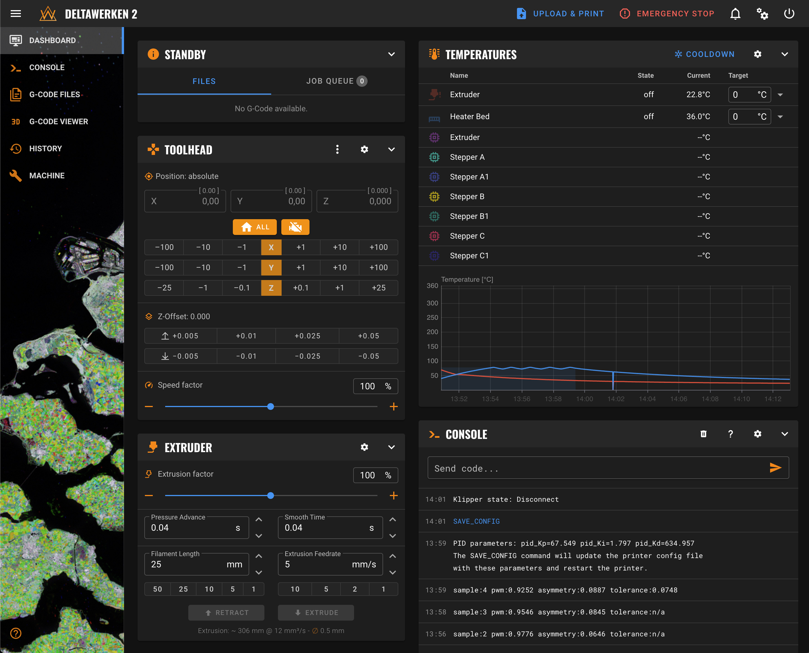

# DeltaWerken Mainsail theme

Theme for the [Mainsail](https://docs.mainsail.xyz/) Klipper User Interface.

## Screenshot



## Installation

SSH to your Klipper installation, then:

```console
cd
git clone https://github.com/DeltaWerken/DeltaWerken-Mainsail-Theme
cd DeltaWerken-Mainsail-Theme
bash ./install.sh
```

